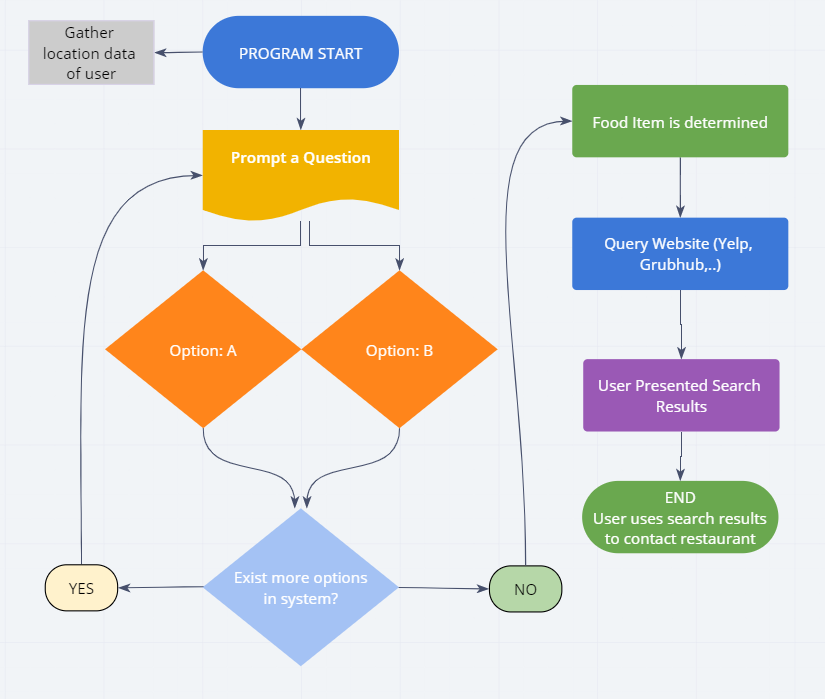

# Midterm Demo: Team Bacon
 
## Overview:  
Name of Project: Honey, I Don’t Care!  
  
Summary of idea.
To have a decision tree to help the user decide what to eat. Once the user knows what to eat, the system will do web scrapping to present options on where to order the food.  

## Dependencies  
- python = "^3.8"
- pyfiglet = "^0.8.post1"  
- colorama = "^0.4.3"
- termcolor = "^1.1.0"
- requests = "^2.23.0"
- bs4 = "^0.0.1"

## Authors  
- Software Developer: Corey DeJong
    - [Official Github](https://github.com/CoreyDeJong)  
- Software Developer: Iris Leal
    - [Official Github](https://github.com/ilealm)  
- Software Developer: Joseph Zabaleta
  - [Official Github](https://github.com/joseph-zabaleta)  

## License  
This project is under the MIT License.

## Acknowledgements / Resources / Inspiration Links
- ASCII Art and Colors  
    - [Link to Article](https://stackoverflow.com/questions/9632995/how-to-easily-print-ascii-art-text)  
- Terminal Colors  
    - [Link to Documentation](https://pypi.org/project/termcolor/)  
- Curses Library / Menu  
    - [Link to Video Part 1](https://www.youtube.com/watch?v=BK7YvpTT4Sw&list=PLyb_C2HpOQSBxk3yBBcrUHReH9BwMUYhG)  
    - [Link to Video Part 2](https://www.youtube.com/watch?v=zwMsmBsC1GM)  
    - [Link to Repo with Note Books](https://github.com/nikhilkumarsingh/python-curses-tut)    
- Location Resource  
    - [Link to Video](https://www.youtube.com/watch?v=OlSQ2TEP3oc)  

## Version History  
- 1.0.0 20200603
    - Initial files created. 
- 1.0.1 20200604  
    - Added requirements.md  
- 1.0.2 20200605  
    - Completed Software Requirements Document  
    - Completed Data-Flow Image  
    - Worked on User Stories and updating README
- 1.0.3 20200608  
    - Created a Intro module 
    - Created a Tree module
    - Created basic scraper functionality
    - Established main.py    
- 1.0.4 20200609  
    - Modified the intro with curses  
    - Integrated Validation to tree module inputs  
    - Tree questions were expanded  
    - Cleaned / improve tree and scraper modules.  
- 1.0.5 20200610  
    - Created first version of location module  
    - Created first version of saving/rendering history  
    - Created first version of random feature  
    - Modified Intro module to include history and random features.  
- 1.0.6 20200611  
    - Project grooming  
    - Documentation Review/Update  

---

## Initial Wireframe  

## User Stories 
[Link to Project Management Board](https://trello.com/b/wWMxIXzY/i-dont-know)  

- As a user I want to be able to select answers to a series of questions that will give me more specific results
- As a user I want to be able to review search results given the results of the questions
- As an admin, I want to be able to update the questions

## Software Requirements  
[Link to Software Requirements](requirements.md)

## Domain Modeling  
