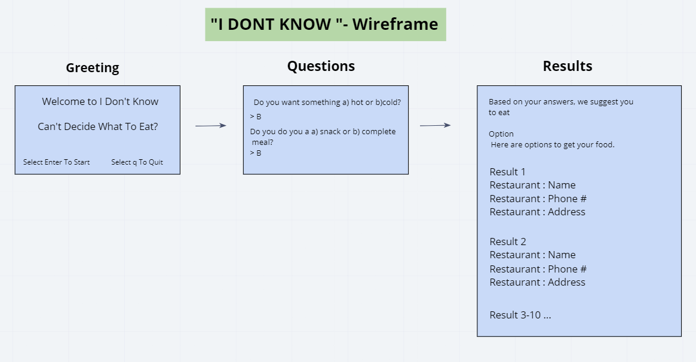

# Midterm Demo: Team Bacon
 
## Overview  
  Corey was here
  
## Dependencies  
- poetry  
- python  
- pyenv  

## Authors  
- Software Developer: Corey DeJong
    - [Official Github](https://github.com/CoreyDeJong)  
- Software Developer: Iris Leal
    - [Official Github](https://github.com/ilealm)  
- Software Developer: Joseph Zabaleta
  - [Official Github](https://github.com/joseph-zabaleta)  

## License  
This project is under the MIT License.

## Acknowledgements / Resources  
- none

## Version History  
- 1.0.0 20200603
    - Initial files created.  

## Initial Wireframe  

## User Stories 
[Link to Project Management Board](https://trello.com/b/wWMxIXzY/i-dont-know)  

## Software Requirements  
[Link to Software Requirements](requirements.md)

## Domain Modeling  
